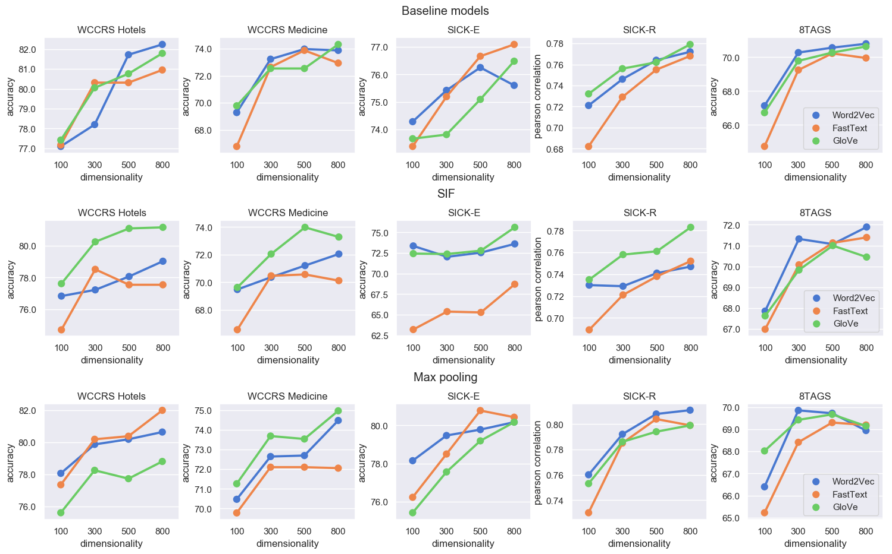

### Evaluation of Sentence Representations in Polish
This repository contains source code from the paper "[Evaluation of Sentence Representations in Polish](https://arxiv.org/pdf/1910.11834.pdf)". 
The paper contains evaluation of eight sentence representation methods (Word2Vec, GloVe, FastText, ELMo, Flair, BERT, LASER, USE) on five polish linguistic tasks.
Dataset for these tasks are distributed with the repository and two of them are released specifically for this evaluation:
the [SICK (Sentences Involving Compositional Knowledge)](https://github.com/text-machine-lab/MUTT/tree/master/data/sick) corpus translated to Polish and 8TAGS classification dataset.
Pre-trained models used in this study are available for download in separate repository: [Polish NLP Resources](https://github.com/sdadas/polish-nlp-resources).

<table>
  <thead>
    <th><strong>#</strong></th>
    <th><strong>Method</strong></th>
    <th><strong>Language</strong></th>
    <th><strong>WCCRS Hotels</strong></th>
    <th><strong>WCCRS Medicine</strong></th>
    <th><strong>SICK-E</strong></th>
    <th><strong>SICK-R</strong></th>
    <th><strong>8TAGS</strong></th>
  </thead>
  <tr>
    <td colspan="8"><strong>Word embeddings</strong></td>
  </tr>
  <tr><td>1</td><td>Random</td><td>n/a</td><td>65.83</td><td>60.64</td><td>72.77</td><td>0.628</td><td>31.95</td></tr>
    <tr><td>2</td><td>Word2Vec</td><td>Polish</td><td>78.19</td><td><strong>73.23</strong></td><td><strong>75.42</strong></td><td>0.746</td><td><strong>70.27</strong></td></tr>
    <tr><td>3</td><td>GloVe</td><td>Polish</td><td>80.05</td><td>72.54</td><td>73.81</td><td><strong>0.756</strong></td><td>69.78</td></tr>
    <tr><td>4</td><td>FastText</td><td>Polish</td><td><strong>80.31</strong></td><td>72.64</td><td>75.19</td><td>0.729</td><td>69.24</td></tr>
  <tr>
    <td colspan="8"><strong>Language models</strong></td>
  </tr>
  <tr><td>5</td><td>ELMo (all)</td><td>Polish</td><td><strong>85.52</strong></td><td>78.42</td><td>77.15</td><td><strong>0.789</strong></td><td>71.41</td></tr>
    <tr><td>6</td><td>ELMo (top)</td><td>Polish</td><td>83.20</td><td>78.17</td><td>74.05</td><td>0.756</td><td>71.41</td></tr>
    <tr><td>7</td><td>Flair</td><td>Polish</td><td>80.82</td><td>75.46</td><td><strong>78.43</strong></td><td>0.743</td><td>65.62</td></tr>
  <tr><td>8</td><td>RoBERTa</td><td>Polish</td><td>85.26</td><td><strong>79.31</strong></td><td>74.17</td><td>0.710</td><td>70.56</td></tr> 
  <tr><td>9</td><td>XLM-RoBERTa</td><td>Multilingual</td><td>85.07</td><td>78.91</td><td>61.50</td><td>0.568</td><td><strong>73.35</strong></td></tr> 
    <tr><td>10</td><td>BERT</td><td>Multilingual</td><td>76.83</td><td>72.54</td><td>73.83</td><td>0.698</td><td>65.05</td></tr>
  <tr>
    <td colspan="8"><strong>Sentence encoders</strong></td>
  </tr>
  <tr><td>11</td><td>LASER</td><td>Multilingual</td><td><strong>81.21</strong></td><td><strong>78.17</strong></td><td><strong>82.21</strong></td><td>0.825</td><td>64.91</td></tr>
    <tr><td>12</td><td>USE</td><td>Multilingual</td><td>79.47</td><td>73.78</td><td>82.14</td><td><strong>0.833</strong></td><td><strong>69.92</strong></td></tr>
</table>

Table: Evaluation of sentence representations on four classification tasks and one semantic relatedness task (SICK-R). For classification, we report accuracy of each model. For semantic relatedness, Pearson correlation between true and predicted relatedness scores is reported.

### Updates:

- **01.02.2020** - Added [Polish RoBERTa](https://github.com/sdadas/polish-nlp-resources#roberta) model and multilingual [XLM-RoBERTa (large)](https://github.com/pytorch/fairseq/tree/master/examples/xlmr) model

### Evaluated methods:

1. Randomly initialized word embeddings
2. 300 dimensional Word2Vec ([Distributed Representations of Words and Phrases and their Compositionality](https://papers.nips.cc/paper/5021-distributed-representations-of-words-and-phrases-and-their-compositionality.pdf)) model pre-trained by us.
3. 300 dimensional GloVe ([Glove: Global Vectors for Word Representation](https://www.aclweb.org/anthology/D14-1162.pdf)) model pre-trained by us. [[Download]](https://github.com/sdadas/polish-nlp-resources#glove)
4. 300 dimensional FastText ([Enriching Word Vectors with Subword Information](https://arxiv.org/pdf/1607.04606.pdf)) model pre-trained by us.
5. ELMo language model described in [Deep contextualized word representations](https://arxiv.org/pdf/1802.05365.pdf) paper, pre-trained by us for Polish. In this experiment, we construct the word representation by concatenating all hidden states of LM. [[Download]](https://github.com/sdadas/polish-nlp-resources#elmo)
6. The same ELMo Polish model as described above. In this experiment, only the top LM layer is used as word representation.
7. Flair language model described in [Contextual String Embeddings for Sequence Labeling](https://www.aclweb.org/anthology/C18-1139.pdf). We concatenate the outputs of the original `pl-forward` and `pl-backward` pre-trained language models available in the [Flair framework](https://github.com/flairNLP/flair).
8. RoBERTa language model described in [RoBERTa: A Robustly Optimized BERT Pretraining Approach](https://arxiv.org/abs/1907.11692), pre-trained by us for Polish. [[Download]](https://github.com/sdadas/polish-nlp-resources#roberta)
9. XLM-RoBERTa is a large, multilingual language model trained by Facebook on 2.5 TB of text extracted from CommonCrawl. More information in their paper [Unsupervised Cross-lingual Representation Learning at Scale](https://arxiv.org/pdf/1911.02116.pdf). [[Download]](https://github.com/pytorch/fairseq/tree/master/examples/xlmr)
10. Original BERT language model by Google described in [BERT: Pre-training of Deep Bidirectional Transformers for Language Understanding](https://arxiv.org/pdf/1810.04805.pdf). We use the `bert-base-multilingual-cased` version. [[Download]](https://github.com/google-research/bert/blob/master/multilingual.md)
11. Multilingual sentence encoder by Facebook, presented in [Massively Multilingual Sentence Embeddings for Zero-Shot Cross-Lingual Transfer and Beyond](https://arxiv.org/pdf/1812.10464.pdf). [[Download]](https://github.com/facebookresearch/LASER)
12. Multilingual sentence encoder by Google, presented in [Multilingual Universal Sentence Encoder for Semantic Retrieval](https://arxiv.org/pdf/1907.04307.pdf).

Figure: Evaluation of aggregation techniques for word embedding models with different dimensionalities. Baseline models use simple averaging, SIF is a method proposed by Arora et al. (2017), Max Pooling is a concatenation of arithmetic mean and max pooled vector from word embeddings.

### Usage

`evaluate_all.py` is used for evaluation of all available models. \
Run `evaluate.py [model_name] [model_params]` to evaluate single model. For example, `evaluate.py word2vec` runs evaluation on `word2vec_100_3_polish.bin` model.
Please note that in case of static embeddings and ELMo, you need to manually download the model from [Polish NLP Resources](https://github.com/sdadas/polish-nlp-resources) and place it in the `resources` directory.

### Acknowledgements
This evaluation is based on [SentEval](https://github.com/facebookresearch/SentEval) modified by us to support models, tasks and preprocessing for Polish language.
We'd like to thank authors of SentEval toolkit for making their code available. 

Two tasks in this study are based on [Wroclaw Corpus of Consumer Reviews](https://clarin-pl.eu/dspace/handle/11321/700).  We would like to thank the authors for making this data collection available.

